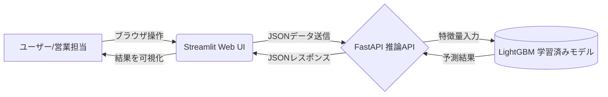

# 顧客解約予測 AIシステム (Customer Churn Prediction AI)

通信キャリアなどのサブスクリプション型ビジネスにおいて、顧客の解約（チャーン）を事前に予測し、引き留め施策を支援するための機械学習APIおよびWebアプリケーションです。

## 🎯 ビジネス課題と目的
* **課題:** 既存顧客の解約は、新規顧客獲得の5倍のコストがかかると言われています（1:5の法則）。しかし、全顧客に対して一律の引き留めキャンペーン（割引など）を行うと、利益率が圧迫されます。
* **解決策:** 顧客の属性データ（契約期間、月額料金、オプション加入状況など）から、LightGBMを用いて「解約リスク」を高精度に予測。リスクが高い顧客にのみターゲットを絞った効果的なマーケティング施策を可能にします。

## 🏗 アーキテクチャ図
フロントエンドとバックエンドを完全に分離し、モダンなAPI駆動アーキテクチャを採用しています。



* **Frontend:** Streamlit (Python)
* **Backend:** FastAPI (Python)
* **Machine Learning:** scikit-learn, LightGBM
* **Infrastructure:** Docker, Docker Compose

## 🚀 環境構築と起動手順
本システムは、バックエンドAPIをDockerでコンテナ化しており、環境に依存せず簡単に起動可能です。

### 前提条件
* Docker および Docker Compose がインストールされていること
* Python 3.10以上 がインストールされていること（フロントエンド起動用）

### 1. バックエンドAPIの起動（Docker）
リポジトリをクローンし、プロジェクトルートディレクトリで以下のコマンドを実行します。
```bash
docker compose up --build
```

### 2. フロントエンドWeb画面の起動（Streamlit）
別のターミナルを開き、必要なライブラリをインストールした上でStreamlitを起動します。
```bash
pip install streamlit requests
streamlit run frontend/app.py
```

* **Web UI:** `http://localhost:8501`

## 🔌 APIエンドポイント仕様
FastAPIにより、自動でOpenAPI仕様のドキュメントが生成されます。

### `POST /predict`
顧客データを受け取り、解約予測結果を返します。

**リクエストボディ (JSON):**
```json
{
  "tenure": 12,
  "MonthlyCharges": 85.50,
  "Contract": "Month-to-month",
  "gender": "Female",
  "SeniorCitizen": 0,
  "Partner": "Yes",
  "Dependents": "No",
  "InternetService": "Fiber optic",
  "PaymentMethod": "Electronic check",
  "PaperlessBilling": "Yes",
  "PhoneService": "Yes",
  "MultipleLines": "No",
  "OnlineSecurity": "No",
  "OnlineBackup": "Yes",
  "DeviceProtection": "No",
  "TechSupport": "No",
  "StreamingTV": "Yes",
  "StreamingMovies": "No",
  "Num_Additional_Services": 2
}
```

**レスポンス (JSON):**
```json
{
  "prediction": 1,
  "probability": 0.7302,
  "message": "High risk of churn (解約リスク高)"
}
```

### `GET /health`
APIサーバーの死活監視（ヘルスチェック）用エンドポイントです。正常稼働時は以下のレスポンスを返します。
```json
{
  "status": "ok",
  "message": "API is running correctly."
}
```