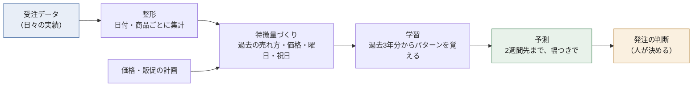

# プロジェクト概要（1枚）

> **⚠️ この文書の数字は、いま再現できません。**
> 2026-08-21 に予測の目的を「発注向けの日次需要予測」から
> 「経営層向けの売上着地予測」へ変更し、データ基盤から作り直しました。
> ここに載っている精度の数字は**前身のシステムのもの**で、現在のコードでは再現しません。
> 説明の枠組み（指標の意味・評価の考え方・チェックリスト）はそのまま使えます。
> 数字は課題①の実装後に差し替えます。→ [予測の目的定義](../objective.md)

**対象読者**: 全員（機械学習の知識は不要）

---

## 一言でいうと

> **「2週間先まで、何がいくつ売れそうか」を、幅つきで毎日示す仕組み。**

「明日 100 個売れます」ではなく、**「だいたい 100 個。少なくとも 83、多くて 147」**と返す。
幅がなければ、いくつ仕入れるかを決められないためである。

---

## 何の役に立つのか

発注担当は毎日この判断をしている。

| 仕入れすぎると | 少なすぎると |
| --- | --- |
| 在庫が積み上がる | 欠品して売り逃す |
| 保管費・廃棄が出る | 客が競合に流れる |
| 資金が寝る | 営業の信用を失う |

**どちらに転んでもコストが出る。** この仕組みは、そのコストが最小になる数量を
選ぶための材料を出す。数量そのものを自動で決めるわけではない。

---

## 全体の流れ

図の右端「発注の判断」だけが人の仕事である。
左から4つは毎日自動で回る。

---

## 現在の到達点

2種類の業務データで検証している。

| | 小売（毎日売れる商品） | 法人取引（BtoB） |
| --- | --- | --- |
| 予測できる範囲 | 2週間先まで | 10営業日先まで |
| 対象 | 店舗 × 商品 18種類 | 部署 × 商品 30種類 |
| **精度（外し方）** | **28.7%** | **37.9%** |
| 何もしない場合 | 41.1% | 53.0% |
| **改善幅** | **30% 改善** | **28% 改善** |

「28.7%」の読み方は [精度の読み方](04-reading-accuracy.md) を参照。
ざっくり言えば **「在庫全体で3割ぶん外す」**ということで、
需要予測としては実用の入口に立った水準である。

---

## いま**できないこと**（重要）

過大な期待を持たれると、あとで必ず信頼を損なうため先に書く。

| できないこと | 内容 |
| --- | --- |
| **幅の精度が足りない** | 「80%の確率でこの範囲」と言いながら、実際は70〜74%しか収まらない。**このままでは安全在庫の計算に使えない**（改善作業中） |
| **少なめに出る癖がある** | 合計すると実績より 8〜11% 低く出る。総量の計画に使うなら補正が要る |
| 新商品の予測 | 過去の実績が無い商品は予測できない |
| 突発的な出来事 | 災害・法改正・競合の撤退などは、データに前例が無いため読めない |
| 価格が直前まで決まらない業務 | 「価格は事前に確定している」前提で作っている |

---

## このリポジトリの性格について

**練習用のデータで作っている。** 実際の取引データではなく、
業務の形を模したデータを自分で生成して使っている。

そのため **「この精度が実務でそのまま出る」とは言えない。**
詳しくは [データについての注意](../data-understanding.md) に、
何が作り物で何がそうでないかを分けて書いている。

見ていただきたいのは精度の数字そのものではなく、
**精度をどう定義し、どう検証し、どこまでを限界と示したか**のほうである。

---

## もっと知りたい方へ

| 知りたいこと | 読む場所 |
| --- | --- |
| 導入するといくら効くのか | [ビジネス課題と効果](02-business-case.md) |
| 出てくる言葉の意味 | [用語集](03-glossary.md) |
| 「28.7%」をどう評価すべきか | [精度の読み方](04-reading-accuracy.md) |
| 技術的な中身 | [リポジトリのREADME](../../README.md) |
